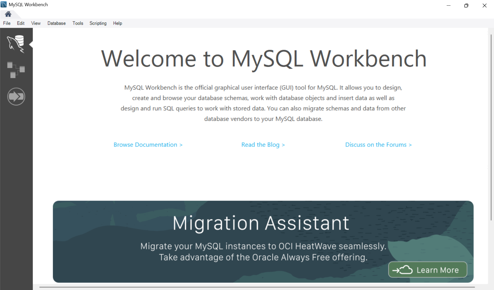

# Capstone HR & Global Payroll Analysis (SQL)


---

## Executive Summary
This project analyzes a global workforce database using SQL to uncover insights into payroll distribution, staffing structure, and talent segmentation.

Key findings include:
- Executive and senior management roles earn **average salaries above $12,000**
- Several job titles have **zero employees**, indicating structural gaps
- High earners represent a critical segment for **leadership development**

---

## Business Context
HR and Finance teams require a centralized, data-driven approach to:
- Monitor payroll costs  
- Evaluate departmental efficiency  
- Identify workforce gaps  

This project replaces manual reporting with SQL-driven analysis, enabling faster and more accurate decision-making.

---

## Objectives
This analysis answers the following business questions:

- Which departments have the highest and lowest headcount?
- What is the total and average salary by department and country?
- How are employees distributed across salary bands?
- Which job titles currently have zero employees?
- Which employees earn above the global average?

---

## Data Overview
- **Database Schema:** `capstone`
- **Core Tables:**
  - employees
  - departments
  - jobs
  - countries
- **Relationships:**
  - Linked via `department_id`, `job_id`, and `country_id`

---

## Key Metrics Snapshot
- Global Workforce: Multi-country dataset
- High Salary Threshold: $10,000+
- Executive Salary Benchmark: $12,000+
- Salary Bands: Low, Medium, High

---

## Key Findings
- **Payroll Concentration:**
  - Certain countries account for a disproportionate share of total salary expenditure

- **Salary Segmentation:**
  - Employees are clearly distributed into Low, Medium, and High salary bands

- **Vacant Roles:**
  - Multiple job titles have no assigned employees, indicating hiring gaps

- **Departmental Load:**
  - Headcount analysis highlights resource-heavy departments

---

## Data Cleaning and Transformation (SQL)

- **Aggregation:**
  - Used `GROUP BY` to summarize salary and headcount data

- **Rounding:**
  - Applied `ROUND(AVG(salary), 2)` for consistent financial reporting

- **Conditional Logic:**
  - Created salary bands using `CASE`:
    - Low (< $5,000)
    - Medium ($5,000–$10,000)
    - High (> $10,000)

- **Joins:**
  - Combined tables using `INNER JOIN` and `LEFT JOIN` for relational analysis

---

## Detailed Analysis & Insights

### 1. Headcount by Department
**Query:**
```sql

SELECT 
    d.department_name, 
    COUNT(e.employee_id) AS headcount 
FROM capstone.departments d 
JOIN capstone.employees e 
    ON d.department_id = e.department_id 
GROUP BY d.department_name 
ORDER BY headcount DESC;
```
#### Finding: 
By joining the departments and employees tables, I discovered that certain departments (e.g., Executive or Sales) carry a significantly higher headcount than others.
#### Analyst Insight:
This suggests that the organization is heavily weighted toward specific operational areas, which may require a review of labor cost distribution.


### 2. Average Salary by Department
**Query:**
```sql
SELECT 
    d.department_name, 
    ROUND(AVG(e.salary), 2) AS average_salary
FROM capstone.departments d
JOIN capstone.employees e 
    ON d.department_id = e.department_id
GROUP BY d.department_name
ORDER BY average_salary DESC;
```
#### Finding:
The query calculates the average salary for each department using aggregation.
#### Analyst Insight:
Departments with higher average salaries likely consist of senior-level or specialized roles, indicating where the organization invests most in talent.

### 3. Salary Segmentation
**Query:**
```sql
SELECT 
    CASE 
        WHEN salary < 5000 THEN 'Low'
        WHEN salary BETWEEN 5000 AND 10000 THEN 'Medium'
        ELSE 'High'
    END AS salary_band,
    COUNT(*) AS employee_count
FROM capstone.employees
GROUP BY salary_band;
```
#### Finding:
Using a CASE statement, employees were grouped into Low, Medium, and High salary bands based on defined thresholds.
#### Analyst Insight:
This segmentation provides a clear view of how the workforce is distributed across salary levels and highlights the proportion of employees in high-cost roles.

### 4. Departments per Country
**Query:**
```sql
SELECT 
    c.country_name, 
    COUNT(d.department_id) AS department_count
FROM capstone.countries c 
LEFT JOIN capstone.departments d 
    ON c.country_id = d.location_id 
GROUP BY c.country_name;
```
#### Finding:
This uses a LEFT JOIN between the countries and departments tables.
#### Analyst Insight:
This measures our operational footprint. A country with zero departments is a "dormant" region where we have a legal presence but no active business units.

### 5. Employees Above Average Salary
**Query:**
```sql
SELECT 
    emp_name, 
    salary
FROM capstone.employees
WHERE salary > (
    SELECT AVG(salary) 
    FROM capstone.employees);
```
#### Finding:
I used a subquery to filter employees earning more than the company-wide mean.
#### Analyst Insight:
These are your "Premium Talent" assets. Monitoring this group is vital for retention, as they represent the most significant individual investments by the company.

### 6. High-Paying Job Roles (CTE)
**Query:**
```sql
WITH JobSalaries AS (
    SELECT 
        j.job_title, 
        AVG(e.salary) AS avg_job_salary
    FROM capstone.jobs j
    JOIN capstone.employees e 
        ON j.job_id = e.job_id
    GROUP BY j.job_title
)
SELECT * 
FROM JobSalaries 
WHERE avg_job_salary > 12000;
```
#### Finding:
Using a Common Table Expression (CTE), I isolated roles with an average salary over $12,000.
#### Analyst Insight:
This isolates the "Elite Roles". It allows the business to see which specific job titles are driving the highest costs, regardless of which department they are in.

### 7. Payroll by Country
**Query:**
```sql
SELECT 
    c.country_name, 
    SUM(e.salary) AS total_payroll
FROM capstone.countries c
JOIN capstone.employees e 
    ON c.country_id = e.country_id 
GROUP BY c.country_name
ORDER BY total_payroll DESC;
```
#### Finding:
I aggregated the SUM of all salaries by geographic location.
#### Analyst Insight:
This is a crucial Finance metric. It identifies which countries are the most expensive to operate in, which is essential for determining the ROI of global expansion.

### 8. Structural Gaps
**Query:**
```sql
SELECT 
    j.job_title
FROM capstone.jobs j
LEFT JOIN capstone.employees e 
    ON j.job_id = e.job_id
WHERE e.employee_id IS NULL;
```
#### Finding:
The query uses a LEFT JOIN combined with a NULL filter to identify job titles that have no associated employees.
#### Analyst Insight:
These are "Ghost Roles". This discovery forces management to decide: do we fill these positions, or do we delete them to simplify our corporate structure?

## Key SQL Techniques Used
- INNER JOIN and LEFT JOIN
- GROUP BY and Aggregations
- Subqueries
- Common Table Expressions (CTEs)
- CASE statements for segmentation

## Conclusion
This project demonstrates how SQL can be used to transform relational HR data into actionable insights.
By analyzing payroll distribution, workforce structure, and salary segmentation, the organization can improve hiring strategy, optimize payroll costs, and identify high-value talent for leadership development.
